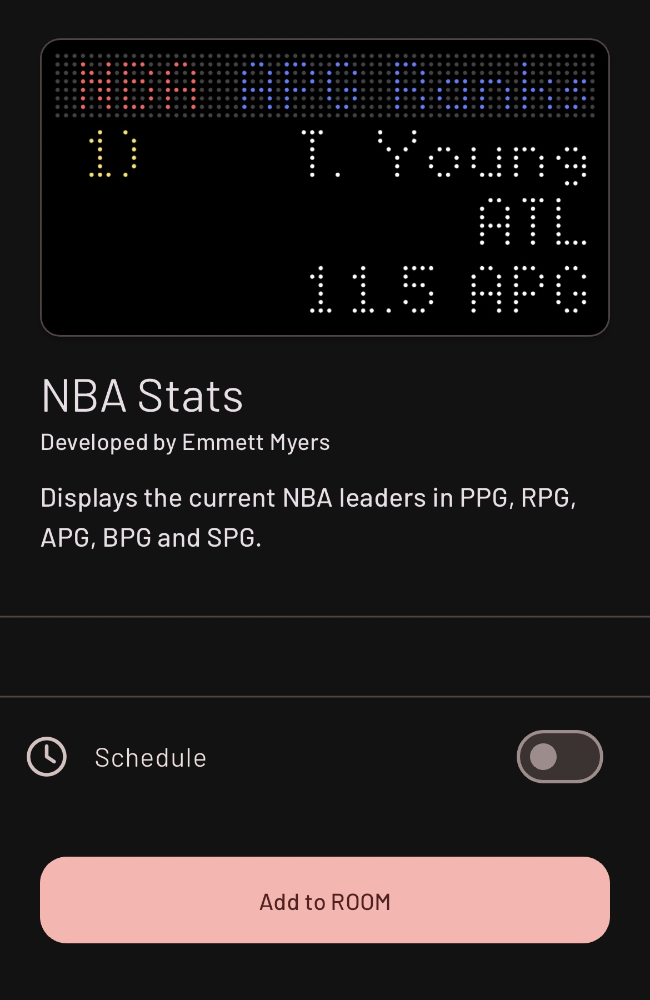

# Tidbyt NBA Stat Leaders Widget

<i>Created: Thanksgiving Break 2023 (College Sophomore) * updated/deployed spring 2025 *</i>

  
  

Parses through the official NBA statistics webpage and obtains the current league leaders in the top 5 most popular stats (points, rebounds, assists, steals, blocks).

Data is visualized, animated, and exported to Tidbyt pixel display devices. The app is publicly available in the Tidbyt App Store with the name "NBA Stat Leaders".

